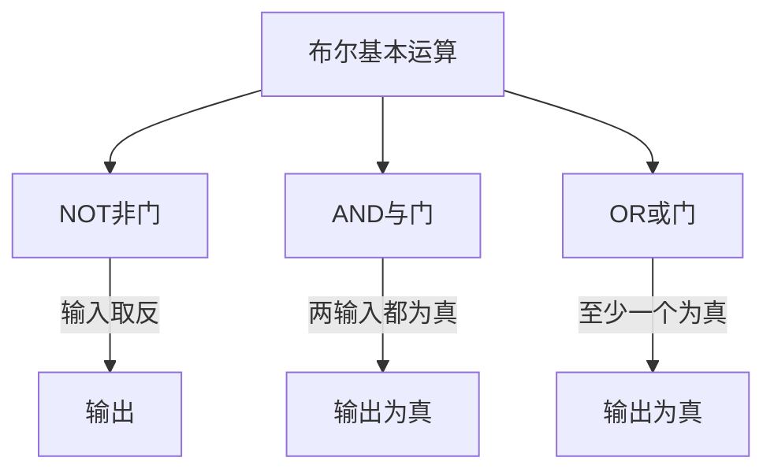
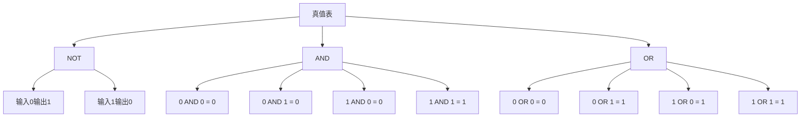

# 布尔逻辑基础

## 基本概念

### 布尔代数
- 由乔治·布尔创立的数学分支
- 只处理两种状态：真(1)和假(0)
- 是现代计算机的基础

### 三种基本运算



### 真值表示例



### XOR (异或)运算
- 两个输入相同时输出为假
- 两个输入不同时输出为真
- 可以用基本逻辑门组合实现

## 练习题

1. 实现NOT运算
```javascript
// 补全代码：实现一个NOT运算
function not(input) {
    // 你的代码：返回input的布尔值取反
}
```

2. 实现AND运算
```javascript
// 补全代码：实现一个AND运算
function and(input1, input2) {
    // 你的代码：返回两个输入的与运算结果
}
```

3. 判断XOR结果
```javascript
// 补全代码：根据XOR运算规则判断结果
function xor(a, b) {
    // 你的代码：返回两个输入的异或运算结果
}
```

<details>
<summary>参考答案</summary>

1. NOT运算
```javascript
function not(input) {
    return !input;
}
```

2. AND运算
```javascript
function and(input1, input2) {
    return input1 && input2;
}
```

3. XOR运算
```javascript
function xor(a, b) {
    return (a || b) && !(a && b);
}
```

</details>