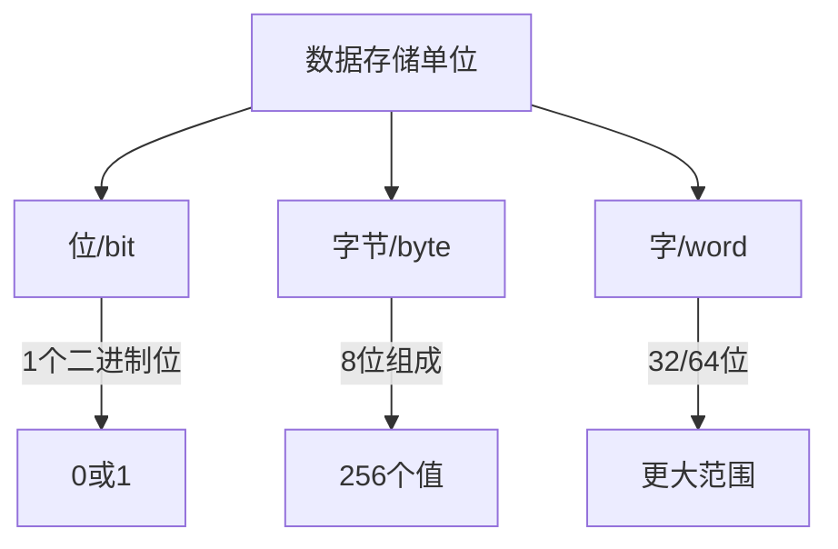
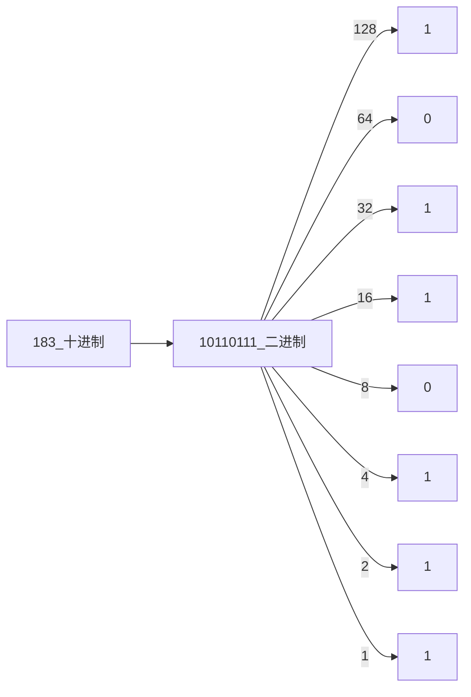
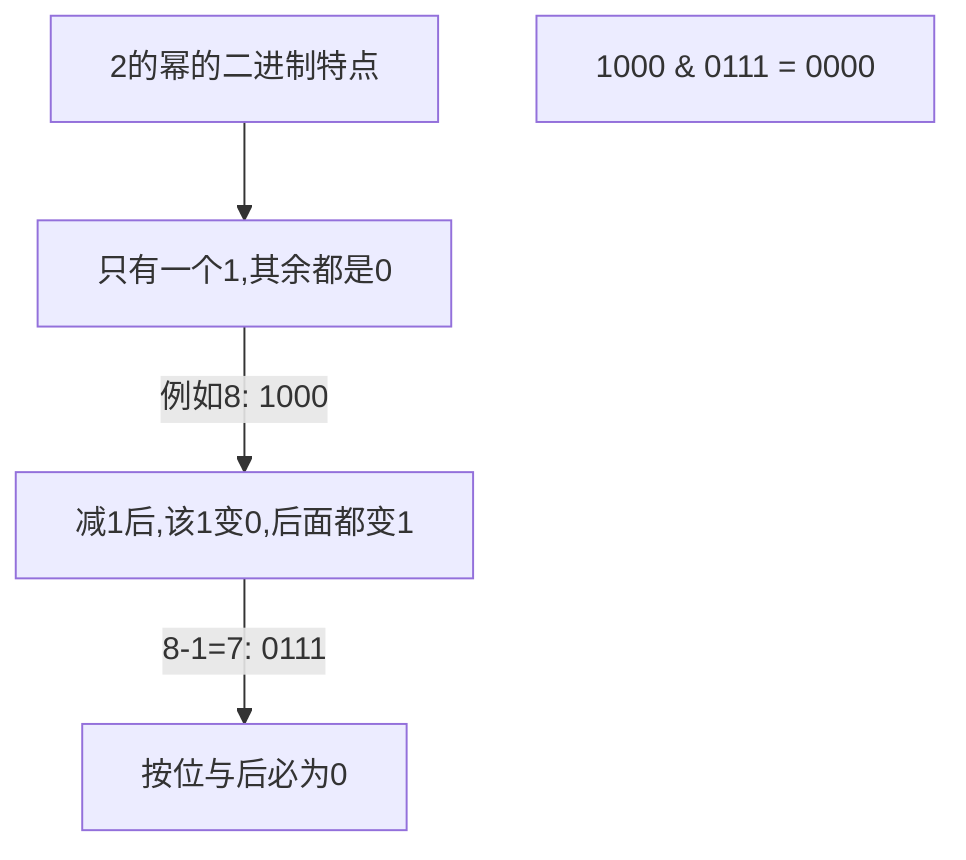
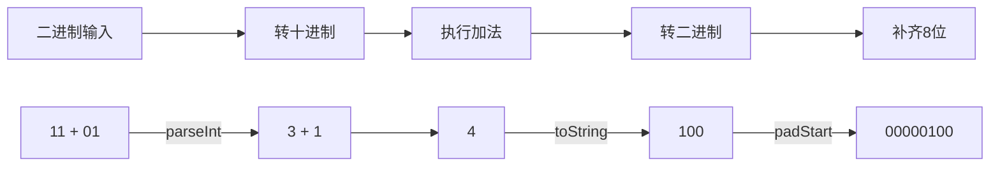

# 计算机中的数字表示

## 基本概念

### 二进制系统
- 只使用0和1两个数字
- 是计算机数据表示的基础
- 每一位的权重是2的幂次方

### 重要术语
- 位(bit): 二进制中的一个数字(0或1)
- 字节(byte): 8个位组成
- 字(word): 计算机一次处理的二进制位数(如32位,64位)



### 数制转换
十进制转二进制示例:


## 练习题

1. 将8位二进制转换为十进制
```javascript
// 补全代码：将8位二进制字符串转为十进制数
function binaryToDecimal(binaryStr) {
    // 你的代码：将binaryStr转换为十进制数
}
```

2. 判断一个数是否为2的幂
```javascript
// 补全代码：判断num是否为2的幂
function isPowerOfTwo(num) {
    // 你的代码：返回true/false
}
```

3. 计算两个8位二进制数的和
```javascript
// 补全代码：计算两个8位二进制数的和(结果也用二进制字符串表示)
function addBinary(a, b) {
    // 你的代码：返回二进制和
}
```

<details>
<summary>参考答案</summary>

1. 二进制转十进制
```javascript
function binaryToDecimal(binaryStr) {
    return parseInt(binaryStr, 2);
}
```

### 2. 判断2的幂
```javascript
function isPowerOfTwo(num) {
    return num > 0 && (num & (num - 1)) === 0;
}
```

这个解法使用了位运算的巧妙技巧:
1. 首先要求`num > 0`,因为0和负数都不是2的幂
2. `num & (num - 1)`这个操作可以判断一个数是否为2的幂,原理如下:



### 3. 二进制加法
```javascript
function addBinary(a, b) {
    return (parseInt(a, 2) + parseInt(b, 2)).toString(2).padStart(8, '0');
}
```

这个解法的步骤是:
1. `parseInt(a, 2)` - 将二进制字符串转为十进制数
2. 执行十进制加法
3. `.toString(2)` - 将结果转回二进制字符串
4. `.padStart(8, '0')` - 补齐8位,左边填充0



</details>