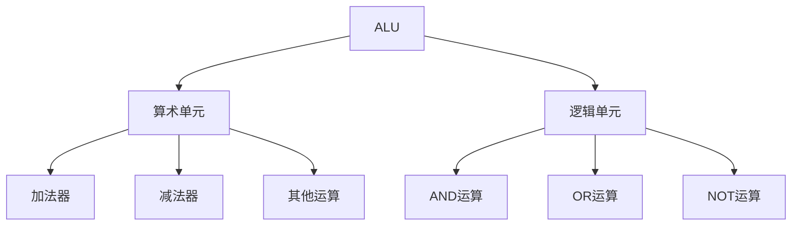
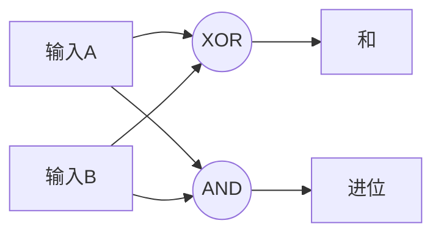
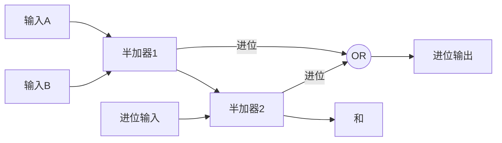

# ALU (算术逻辑单元) 基础知识

## 基本定义
ALU是计算机的数学大脑，负责执行所有的算术和逻辑运算。它由两个主要部分组成：
1. 算术单元 - 处理数值计算
2. 逻辑单元 - 处理逻辑运算

## 关键组件图示




## 半加器结构




## 全加器结构




## 练习题

### 1. 基础概念题
问题：ALU的两个主要组成部分是什么？它们各自的主要功能是什么？

### 2. 代码补全题
完成以下JavaScript代码，实现一个简单的半加器：

```javascript
function halfAdder(a, b) {
    // 补全代码：返回一个包含和(sum)和进位(carry)的对象
    // 提示：使用异或(^)计算和，使用与(&)计算进位
}
```


### 3. 实践题
编写一个函数检查8位二进制数是否会发生溢出：

```javascript
function checkOverflow(num) {
    // 补全代码：检查数字是否超过8位二进制能表示的最大值(255)
    // 返回true表示溢出，false表示未溢出
}
```


### 4. 逻辑运算题
实现一个简单的零检测函数：

```javascript
function isZero(num) {
    // 补全代码：检查输入是否为0
    // 提示：可以直接使用比较运算符
}
```


<details>
<summary>参考答案</summary>

1. 基础概念题答案：
- 算术单元：负责加减等数值计算
- 逻辑单元：负责AND、OR、NOT等逻辑运算

2. 半加器代码：
```javascript
function halfAdder(a, b) {
    return {
        sum: a ^ b,
        carry: a & b
    };
}
```


3. 溢出检查：
```javascript
function checkOverflow(num) {
    return num > 255;
}
```


4. 零检测：
```javascript
function isZero(num) {
    return num === 0;
}
```

</details>