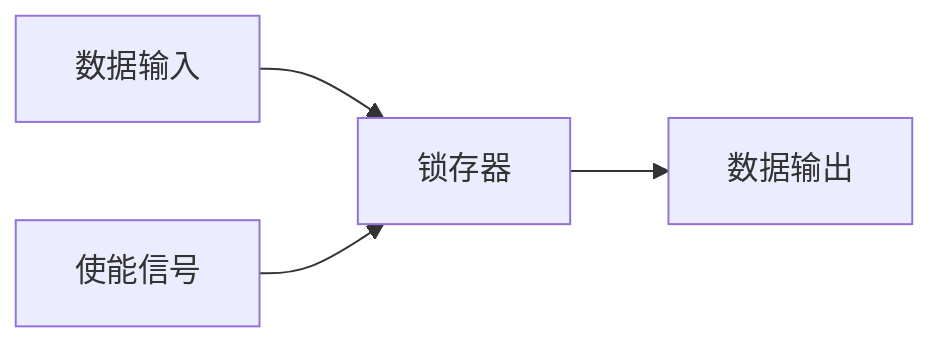
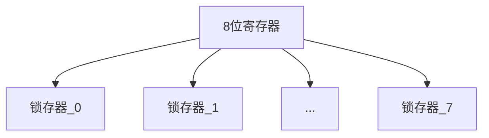
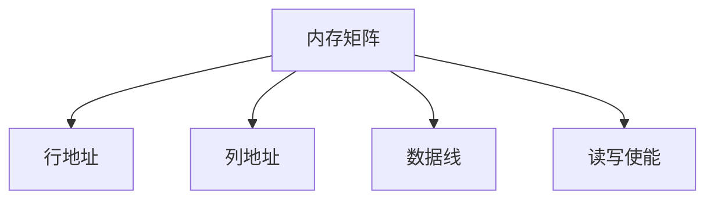

# 存储器与内存

## 基本概念

### 锁存器(Latch)
最基本的存储单元,可以存储1位信息(0或1)。




### 寄存器(Register)
多个锁存器并排放置形成寄存器,可以存储多位数据。




### 内存矩阵
为了节省连线,将锁存器排列成矩阵形式。通过行地址和列地址来访问特定位置。




### RAM(Random Access Memory)
- 可以随机访问任何内存位置
- 需要通电才能保持数据
- 地址位数决定可访问的内存大小
  - 8位地址 = 256字节
  - 32位地址 = 4GB

## 练习题

### 1. 概念题
给定一个8位寄存器,如果要存储数字15,需要用多少个锁存器为1?

<details><summary>参考答案</summary>
15的二进制是00001111,所以需要4个锁存器存储1。
</details>

### 2. 代码补全题
完成以下代码,模拟一个简单的锁存器:

```javascript
class Latch {
    constructor() {
        this.value = 0;
        this.enabled = false;
    }
    
    write(data) {
        // 补全代码:当enabled为true时,将data写入value
    }
    
    read() {
        return this.value;
    }
    
    setEnable(enabled) {
        this.enabled = enabled;
    }
}
```


<details><summary>参考答案</summary>

```javascript
write(data) {
    if(this.enabled) {
        this.value = data;
    }
}
```

</details>

### 3. 代码补全题
完成以下代码,实现一个简单的8位寄存器:

```javascript
class Register {
    constructor() {
        // 补全代码:初始化8个锁存器的数组
    }
    
    writeValue(value) {
        // value是一个0-255的数字
        // 补全代码:将value转换为二进制并写入各个锁存器
    }
}
```


<details><summary>参考答案</summary>

```javascript
constructor() {
    this.latches = Array(8).fill().map(() => new Latch());
}

writeValue(value) {
    const binary = value.toString(2).padStart(8, '0');
    this.latches.forEach((latch, i) => {
        latch.setEnable(true);
        latch.write(Number(binary[i]));
        latch.setEnable(false);
    });
}
```

</details>