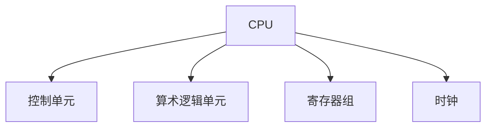
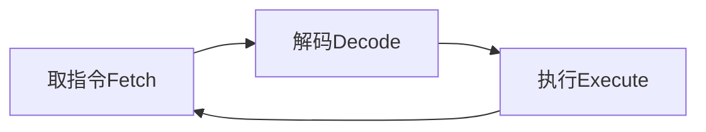
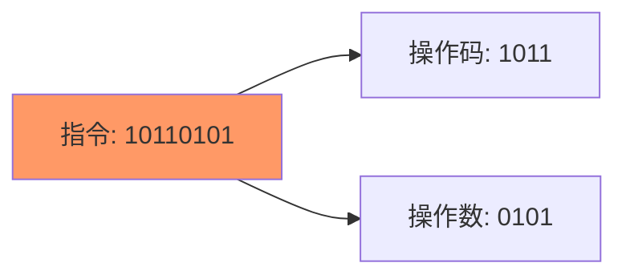
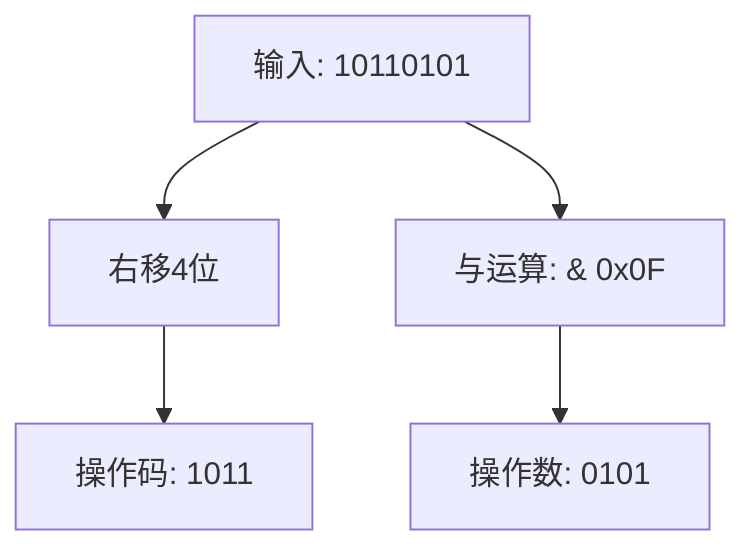
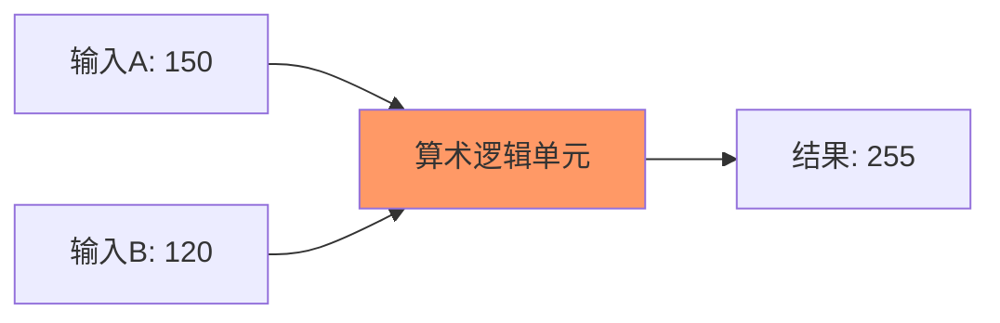

# CPU(中央处理器)基础

## 基本组成部分



## CPU工作周期



## 关键概念

1. **寄存器**: CPU内部的临时存储单元
2. **指令周期**: 取指令->解码->执行的循环过程
3. **时钟速度**: CPU执行指令的频率,以Hz为单位
4. **操作码(OpCode)**: 指令中表示具体操作的部分
5. **动态频率缩放**: CPU根据负载动态调整时钟频率的技术

## 练习题

### 1. 基础概念题

给出CPU的时钟速度是2.4GHz, 请计算每个时钟周期的时间是多少?

<details><summary>参考答案</summary>

1秒 = 1000000000纳秒(ns)
2.4GHz = 2.4 * 10^9 Hz
每个周期时间 = 1/2.4GHz ≈ 0.417纳秒

</details>

### 2. JavaScript代码补全题

完成以下代码, 模拟CPU的取指令-解码-执行循环:

```javascript
class CPU {
    constructor() {
        this.registers = new Array(4).fill(0);
        this.currentInstruction = 0;
    }

    // 补全fetch方法
    fetch() {
        // 从内存获取指令
        // TODO: 将this.currentInstruction加1
    }

    // 补全decode方法
    decode(instruction) {
        // TODO: 从instruction中提取操作码(前4位)和操作数(后4位)
        // 返回格式: {opcode: number, operand: number}
    }
}
```

<details><summary>参考答案</summary>

```javascript
fetch() {
    this.currentInstruction++;
}

decode(instruction) {
    return {
        opcode: instruction >> 4, // 右移4位获取前4位
        operand: instruction & 0x0F // 与运算获取后4位
    };
}
```

# CPU指令解码示例

## 指令格式图示



## 生活中的例子

想象一张订餐单:
* 前半部分(操作码): 表示菜品类型(炒饭)
* 后半部分(操作数): 表示份数(2份)

## 代码示例

```javascript
// 示例1: 解析指令10110101
const instruction = 0xB5; // 二进制：10110101

// 获取操作码(前4位)：1011
const opcode = instruction >> 4; // 结果：11

// 获取操作数(后4位)：0101
const operand = instruction & 0x0F; // 结果：5

console.log(`操作码: ${opcode}, 操作数: ${operand}`);
```

## 实际运行效果



<details><summary>练习</summary>

解析以下指令:
1. `10101010`
2. `11110000`

答案:
1. 操作码=1010(10), 操作数=1010(10)
2. 操作码=1111(15), 操作数=0000(0)

</details>
</details>

### 3. 实现简单ALU

补全以下代码, 实现一个简单的ALU加法操作:

```javascript
class ALU {
    // TODO: 实现add方法,接收两个8位数字(0-255),返回它们的和
    // 如果结果超过255,则返回255(模拟溢出情况)
    add(a, b) {

    }
}
```

<details><summary>参考答案</summary>

```javascript
add(a, b) {
    const result = a + b;
    return result > 255 ? 255 : result;
}
```

# ALU示例详解

## 工作原理图示



## 代码实现

```javascript
class ALU {
    add(a, b) {
        // 1. 检查输入范围（0-255）
        if (a < 0 || a > 255 || b < 0 || b > 255) {
            throw new Error('输入数字必须在0-255之间！');
        }

        // 2. 计算结果
        const result = a + b;

        // 3. 检查溢出
        if (result > 255) {
            console.log('发生溢出！结果将被截断为255');
            return 255;
        }

        // 4. 返回结果
        return result;
    }
}
```

## 测试用例

```javascript
const alu = new ALU();

// 正常计算
console.log(alu.add(100, 50)); // 输出: 150

// 溢出情况
console.log(alu.add(200, 100)); // 输出: 255

// 边界值
console.log(alu.add(255, 1)); // 输出: 255
```

## 为什么是8位（0-255）？

1. 8位二进制最大值：`11111111` = 255（十进制）
2. 常见应用：
   - 图像处理：RGB值（0-255）
   - 网络通信：IP地址段
   - 8位微控制器系统

<details><summary>练习题</summary>

请计算以下ALU运算结果：
1. add(50, 50) = ?
2. add(200, 200) = ?
3. add(0, 255) = ?

答案：
1. 100（正常计算）
2. 255（发生溢出，400超过255）
3. 255（正好是最大值）

</details>

</details>
