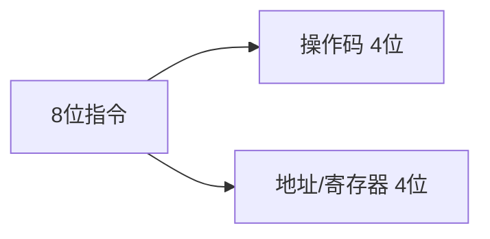
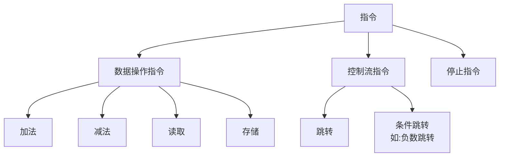
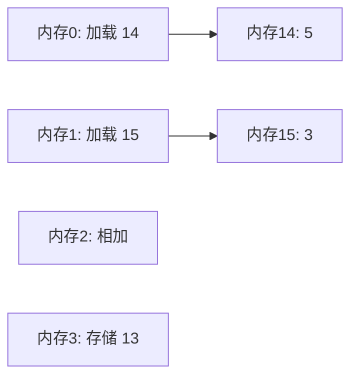
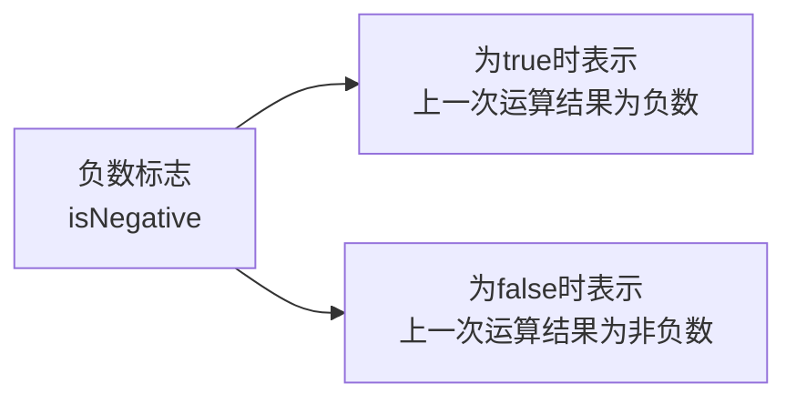
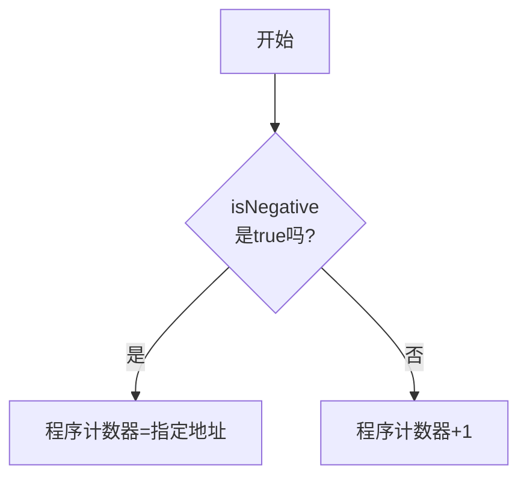

# 指令和程序

## 基本概念

1. 指令结构



2. 基本指令类型



3. 指令长度
* 固定长度指令: 所有指令长度相同(如8位)
* 可变长度指令: 指令长度可变(如1-15字节)

## 练习题

### 1. 理解指令执行

给定以下内存数据, 请说出执行结果:



<details><summary>参考答案</summary>

1. 从内存14加载5到寄存器A
2. 从内存15加载3到寄存器B  
3. 将寄存器A和B相加(5+3=8)
4. 将结果8存储到内存13

</details>

### 2. 代码补全练习

完成下面的JavaScript函数, 模拟一个简单的指令执行器:

```javascript
class CPU {
    constructor() {
        this.registerA = 0;
        this.registerB = 0;
        this.memory = new Array(16).fill(0);
    }

    // 请补全execute函数,实现:
    // 操作码0001: 加载数据到寄存器A
    // 操作码0010: 加载数据到寄存器B
    // 操作码0011: 将寄存器A和B相加,结果存入寄存器A
    execute(opcode, address) {
        // 在这里补充代码
    }
}
```

<details><summary>参考答案</summary>

```javascript
execute(opcode, address) {
    switch (opcode) {
        case 1: // 加载到A
            this.registerA = this.memory[address];
            break;
        case 2: // 加载到B
            this.registerB = this.memory[address];
            break;
        case 3: // 相加
            this.registerA = this.registerA + this.registerB;
            break;
    }
}
```

</details>

### 3. 实现条件跳转

补全下面的代码, 实现一个负数跳转功能:

```javascript
class CPU {
    constructor() {
        this.registerA = 0;
        this.registerB = 0;
        this.isNegative = false;
        this.programCounter = 0;
    }

    // 请补全jumpIfNegative函数
    // 如果isNegative为true,程序计数器跳转到address
    // 否则程序计数器加1
    jumpIfNegative(address) {
        // 在这里补充代码
    }
}
```

<details><summary>参考答案</summary>

```javascript
jumpIfNegative(address) {
    if (this.isNegative) {
        this.programCounter = address;
    } else {
        this.programCounter++;
    }
}
```

# 条件跳转详解

## 基本组件图解

1. **程序计数器**


2. **负数标志**



3. **跳转逻辑**



## 示例代码

```javascript
// 假设我们有这样的指令序列
let instructions = [{
        type: "LOAD",
        value: -5
    }, // 地址0: 加载-5到寄存器
    {
        type: "JMPNEG",
        address: 4
    }, // 地址1: 如果是负数，跳转到地址4
    {
        type: "ADD",
        value: 2
    }, // 地址2: 加2
    {
        type: "ADD",
        value: 3
    }, // 地址3: 加3
    {
        type: "SUB",
        value: 1
    } // 地址4: 减1
]
```

## 完整实现

```javascript
class CPU {
    constructor() {
        this.registerA = 0;
        this.registerB = 0;
        this.isNegative = false;
        this.programCounter = 0;
    }

    // 加载数据并设置负数标志
    load(value) {
        this.registerA = value;
        this.isNegative = value < 0;
    }

    // 条件跳转实现
    jumpIfNegative(address) {
        if (this.isNegative) {
            // 如果是负数，跳转到指定地址
            this.programCounter = address;
        } else {
            // 如果不是负数，继续执行下一条指令
            this.programCounter++;
        }
    }
}
```

## 练习题

实现一个简单的条件跳转程序：

```javascript
// 补全代码，实现：
// 1. 如果输入是负数，跳转到地址4
// 2. 如果不是负数，继续执行下一条指令
```

<details><summary>参考答案</summary>

```javascript
class CPU {
    constructor() {
        this.programCounter = 0;
        this.isNegative = false;
    }

    jumpIfNegative(address) {
        if (this.isNegative) {
            this.programCounter = address;
        } else {
            this.programCounter++;
        }
    }
}
```

</details>
</details>

这些练习题帮助理解:
1. 基本指令的执行流程
2. CPU寄存器的使用
3. 条件跳转的实现原理
