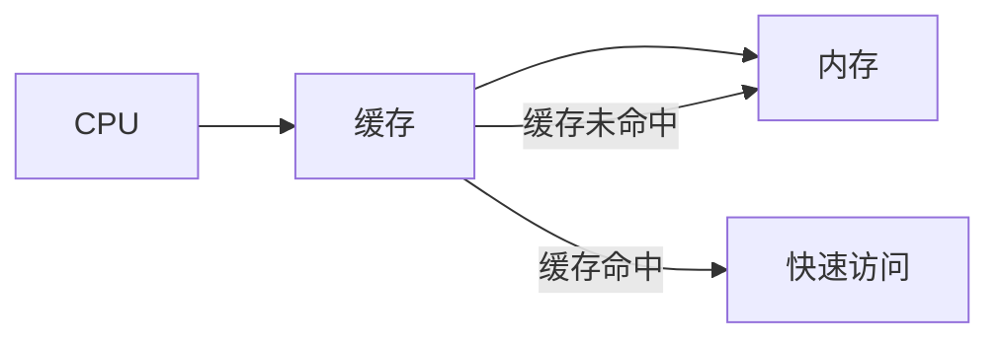
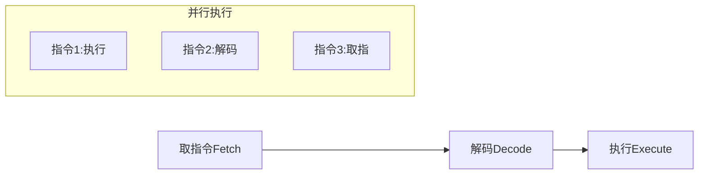
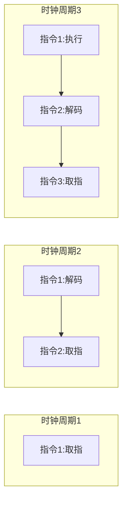
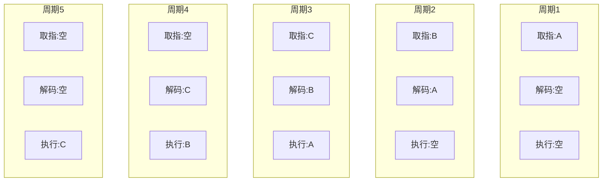
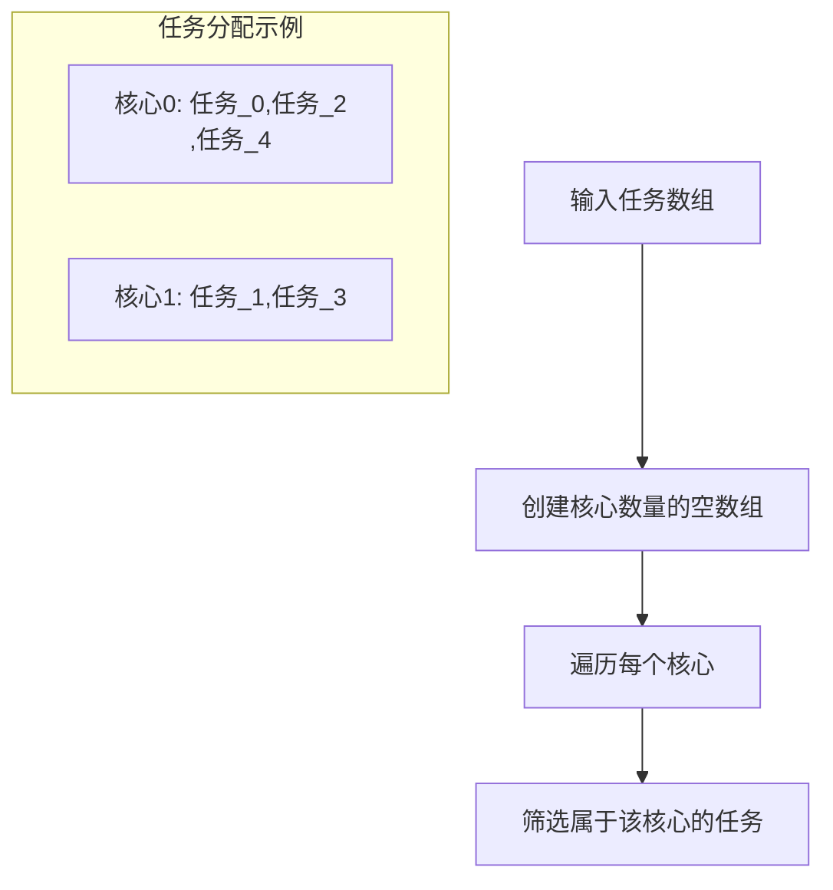
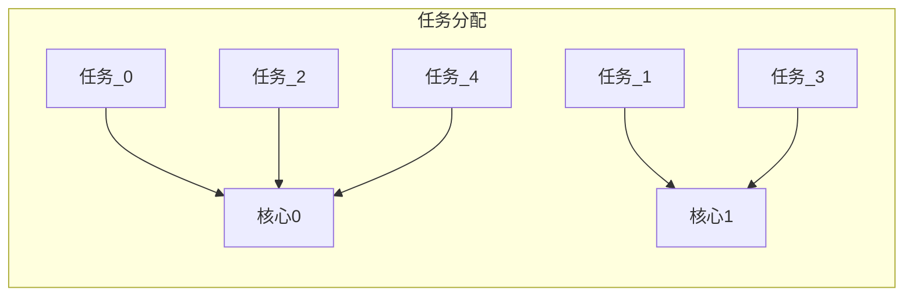

# 高级CPU设计

## 核心概念

### 1. 缓存 (Cache)

缓存是CPU上的一小块高速内存, 用于存储经常访问的数据。



关键特性:
* 缓存命中(Cache Hit): 请求的数据在缓存中找到
* 缓存未命中(Cache Miss): 需要从RAM中获取数据
* 脏位(Dirty Bit): 标记缓存数据是否被修改

### 2. 指令流水线 (Pipeline)



### 3. 超标量处理器

能够在一个时钟周期内执行多条指令的处理器。

### 4. 多核处理器

在单个处理器中集成多个运算核心。

## 练习题

### 1. 缓存概念理解

补全下面的代码, 实现一个简单的缓存系统:

```javascript
class SimpleCache {
    constructor(size) {
        this.cache = new Map();
        this.size = size;
    }

    get(key) {
        // 补全代码: 如果数据在缓存中返回数据,否则返回null
        // 提示: 使用 this.cache.has() 和 this.cache.get()
    }
}
```

<details>
<summary>参考答案</summary>

```javascript
// 题目1答案
get(key) {
    return this.cache.has(key) ? this.cache.get(key) : null;
}
```

</details>

### 2. 流水线模拟

补全代码, 模拟CPU的三级流水线操作:

```javascript
function simulatePipeline(instructions) {
    let cycles = 0;
    let executing = null;
    let decoding = null;
    let fetching = null;

    while (instructions.length > 0 || executing || decoding || fetching) {
        // 补全代码: 模拟一个时钟周期的流水线操作
        // 1. 如果executing不为null,标记其完成
        // 2. 将decoding移入executing
        // 3. 将fetching移入decoding
        // 4. 从instructions中取出新指令到fetching
    }

    return cycles;
}
```

<details>
<summary>参考答案</summary>

```javascript
// 题目2答案
if (executing) executing = null;
executing = decoding;
decoding = fetching;
fetching = instructions.length > 0 ? instructions.shift() : null;
cycles++;
```

# CPU流水线工作原理详解

## 流水线执行过程



## 代码解析

### 1. 关键变量

```javascript
let cycles = 0; // 记录时钟周期数
let executing = null; // 当前正在执行的指令
let decoding = null; // 当前正在解码的指令
let fetching = null; // 当前正在取指的指令
```

### 2. 每个时钟周期的操作

```javascript
// 1. 完成执行阶段的指令
if (executing) executing = null;

// 2. 解码阶段的指令进入执行阶段
executing = decoding;

// 3. 取指阶段的指令进入解码阶段
decoding = fetching;

// 4. 从指令队列中取出新指令进入取指阶段
fetching = instructions.length > 0 ? instructions.shift() : null;

// 5. 时钟周期计数加1
cycles++;
```

## 示例运行过程

假设有指令序列：[A, B, C]



这样，原本需要9个周期（3条指令×3个阶段）的执行过程，通过流水线可以在5个周期内完成，大大提高了CPU的效率。
</details>

### 3. 多核心任务分配

完成以下代码, 实现任务在多核心间的简单分配:

```javascript
function distributeTasksToCore(tasks, coreCount) {
    // 补全代码: 将tasks数组平均分配到coreCount个核心中
    // 返回一个二维数组,每个子数组代表一个核心的任务
    // 提示: 使用Array(coreCount).fill().map()
}
```

<details>
<summary>参考答案</summary>

```javascript
// 题目3答案
function distributeTasksToCore(tasks, coreCount) {
    return Array(coreCount).fill().map((_, i) =>
        tasks.filter((_, index) => index % coreCount === i)
    );
}
```

# 多核心任务分配详解

## 代码实现

```javascript
function distributeTasksToCore(tasks, coreCount) {
    return Array(coreCount).fill().map((_, i) =>
        tasks.filter((_, index) => index % coreCount === i)
    );
}
```

## 执行流程图



## 示例代码

```javascript
const tasks = ['任务A', '任务B', '任务C', '任务D', '任务E'];
const coreCount = 2;

const result = distributeTasksToCore(tasks, coreCount);
/*
结果为:
[
    ['任务A', '任务C', '任务E'], // 核心0的任务
    ['任务B', '任务D']          // 核心1的任务
]
*/
```

## 任务分配流程



</details>
