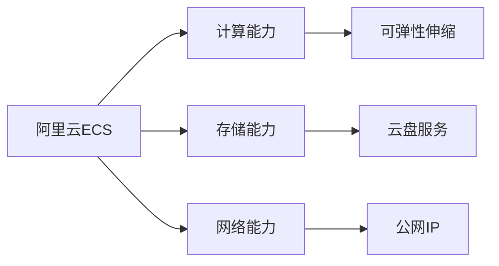
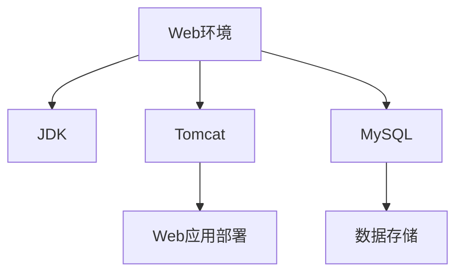

# 阿里云服务器Web环境搭建指南

## 1. 基本概念

### 阿里云服务器
阿里云服务器（ECS）是阿里云提供的一种基础云计算服务，提供可弹性伸缩的计算能力。




### Web环境组件
基础Web环境通常包含以下组件：
- JDK (Java Development Kit)
- Tomcat (Web应用服务器)
- MySQL (数据库)




## 2. 环境搭建流程


## 3. 实践练习题

### 题目1：服务器连接
补充以下Node.js代码，实现SSH连接到服务器：

```javascript
const ssh2 = require('ssh2');
const conn = new ssh2.Client();

// 补充连接配置
const config = {
    _____, // host: 'xx.xx.xx.xx'
    _____, // username: 'root'
    _____ // privateKey: require('fs').readFileSync('/path/to/key')
};
```


### 题目2：文件上传
完成以下代码，实现将本地文件上传到服务器：

```javascript
const sftp = require('ssh2-sftp-client');
const client = new sftp();

async function uploadFile() {
    try {
        await client.connect({
            host: 'xx.xx.xx.xx',
            username: 'root',
            privateKey: require('fs').readFileSync('/path/to/key')
        });
        
        // 补充上传代码
        await client._____ // put('/local/path', '/remote/path')
    } catch (err) {
        console.error(err);
    }
}
```


### 题目3：端口检测
完成以下代码，检测服务器的Tomcat是否正常运行（默认端口8080）：

```javascript
const net = require('net');

function checkTomcat(host) {
    return new Promise((resolve, reject) => {
        const socket = new net.Socket();
        // 补充检测代码
        socket._____ // connect(8080, host)
    });
}
```


<details>
<summary>参考答案</summary>

### 题目1答案：
```javascript
const config = {
    host: 'xx.xx.xx.xx',
    username: 'root',
    privateKey: require('fs').readFileSync('/path/to/key')
};
```


### 题目2答案：
```javascript
await client.put('/local/path', '/remote/path');
```


### 题目3答案：
```javascript
socket.connect(8080, host);
```

</details>

## 4. 注意事项
- 确保服务器安全组配置正确
- 定期备份数据
- 及时更新系统补丁
- 配置防火墙规则
- 使用强密码和密钥对登录

这些内容涵盖了阿里云服务器Web环境搭建的基本知识和实践。通过完成练习题，你可以更好地理解服务器操作和环境配置的过程。